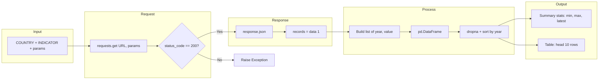

# README: Meaningful World Bank API Query

> Script documentation for [`04_meaningful_worldbank_query.py`](04_meaningful_worldbank_query.py) — World Bank GDP per capita query with formatted output.

---

## Table of Contents

- [Overview](#overview)
- [API Endpoint and Parameters](#api-endpoint-and-parameters)
- [Data Structure of the API Response](#data-structure-of-the-api-response)
- [Usage Instructions](#usage-instructions)
- [Flow Diagram](#flow-diagram)

---

## Overview

[`04_meaningful_worldbank_query.py`](04_meaningful_worldbank_query.py) demonstrates a full workflow for querying the **World Bank Open Data API**, building a clean dataset, and presenting results in a meaningful way. The script:

- Requests **GDP per capita (current US$)** for a configurable country and date range.
- Converts the raw JSON response into a **pandas** DataFrame and drops missing values.
- Prints **summary statistics** (min, max, latest value with years) and a **formatted table** of the most recent 10 years.

It uses **requests** for HTTP, **pandas** for tables and summaries, and optionally **python-dotenv** for environment variables (no API key is required for the World Bank API).

---

## API Endpoint and Parameters

| Item | Value |
|------|--------|
| **Base URL** | `https://api.worldbank.org/v2` |
| **Path** | `/country/{country_code}/indicator/{indicator_code}` |
| **Method** | `GET` |

**Path parameters:**

- **`country_code`** — ISO 2- or 3-letter country code (e.g. `US`, `GB`, `CN`). In the script this is set as `COUNTRY = "US"`.
- **`indicator_code`** — World Bank indicator code. The script uses `NY.GDP.PCAP.CD` (GDP per capita, current US$).

**Query parameters** (sent as `params` in the script):

| Parameter | Example | Description |
|-----------|---------|-------------|
| `format` | `json` | Response format (JSON). |
| `date` | `2000:2023` | Year range (inclusive). |
| `per_page` | `100` | Maximum number of records per response. |

Example full URL:

`https://api.worldbank.org/v2/country/US/indicator/NY.GDP.PCAP.CD?format=json&date=2000:2023&per_page=100`

---

## Data Structure of the API Response

The API returns a **JSON array** of two elements:

1. **`data[0]`** — **Metadata** (object): pagination and result info (e.g. `total`, `page`, `per_page`).
2. **`data[1]`** — **Records** (array of objects): one object per year per country/indicator.

Each element in `data[1]` has this shape:

| Field | Type | Description |
|-------|------|-------------|
| `date` | string | Year (e.g. `"2023"`). |
| `value` | number or `null` | GDP per capita in current US$; `null` when not available. |
| `country` | object | `id` (country code), `value` (country name). |
| `indicator` | object | `id` (indicator code), `value` (indicator name). |
| `unit`, `obs_status`, `decimal` | various | Extra metadata. |

The script uses only `date` and `value`, and drops rows where `value` is missing.

---

## Usage Instructions

### Prerequisites

- **Python 3** with packages: `requests`, `pandas`. Optional: `python-dotenv` if you use a `.env` file.
- Install with:  
  `pip install requests pandas python-dotenv`

### Running the script

1. Open a terminal and go to the project root (or the directory that contains `04_meaningful_worldbank_query.py` and, if used, your `.env`).
2. Run:

```bash
python 01_query_api/04_meaningful_worldbank_query.py
```

If you are already inside `01_query_api`:

```bash
python 04_meaningful_worldbank_query.py
```

3. The script prints:
   - HTTP status code and indicator/country info
   - Record count (after dropping missing values)
   - Summary: min, max, and latest GDP per capita (with years)
   - A table of the 10 most recent years (descending by year)

To change the country or date range, edit `COUNTRY` and the `date` value in the `params` dict in [`04_meaningful_worldbank_query.py`](04_meaningful_worldbank_query.py).

---

## Flow Diagram

The following Mermaid diagram shows the flow from the API request to the final data output.



**Summary:** Configure country/indicator and params → send GET request → check status → parse JSON and take `data[1]` → build list of (year, value) → DataFrame → drop missing, sort → print summary statistics and top 10 rows.

---

← 🏠 [Back to Top](#readme-meaningful-world-bank-api-query) · [Folder README](README.md)
